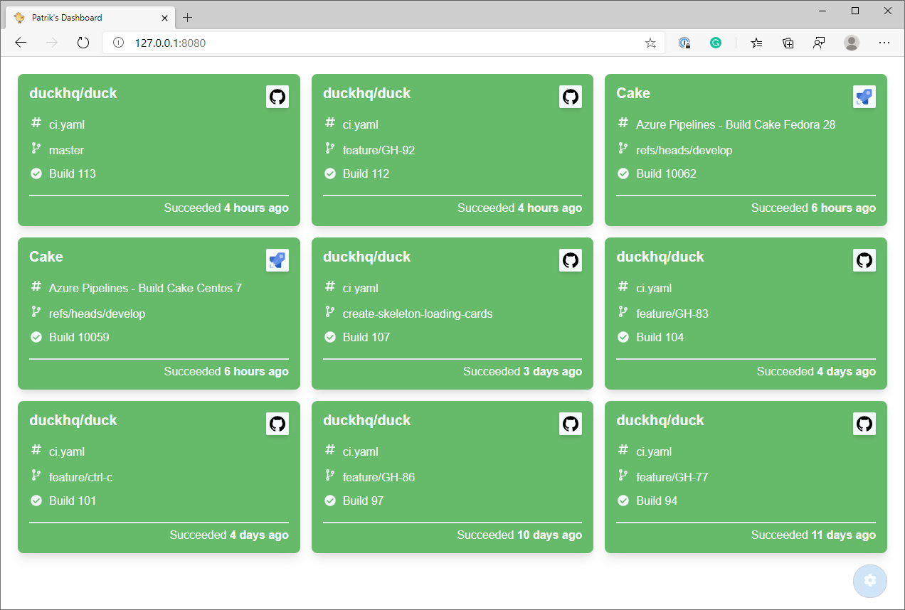

# Duck

Duck is a build system agnostic build monitor written in Rust (backend server) and Vue (frontend). It also support sending messages to Slack and controlling [Philips Hue](https://www2.meethue.com/) lights.



## Table of Contents

1. [Getting started](https://github.com/spectresystems/duck#getting-started)
2. [How it works](https://github.com/spectresystems/duck#how-it-works)
3. [Supported providers](https://github.com/spectresystems/duck#supported-providers)
   - [Collectors](https://github.com/spectresystems/duck#collectors)
   - [Observers](https://github.com/spectresystems/duck#observers)
3. [Configuration](https://github.com/spectresystems/duck#configuration)
   - [Example](https://github.com/spectresystems/duck#example)
4. [License](https://github.com/spectresystems/duck#license)

## Getting started

The absolute easiest way of getting started with Duck is to use the docker image. You will have to provide a configuration file for it to work.

```
> docker run --rm -it -v ~/.config/duck:/data -p 8080:15825 duckhq/duck:latest start --config /data/duck.json
```

*If you're using WSL, you will need to specify the absolute path to your data directory.*

## How it works

The server part is responsible for collecting information from different `collectors` and forward interesting events to `observers`. The aggregated information is available for other services (such as the Vue frontend) via a HTTP API.

Observers can either be dependent on events from all collectors, or opt in to one or more collectors. This makes it easy to setup team specific build lights or Slack integration that's only dependent on specific collectors.


## Supported providers

### Collectors

Collectors are responsible for collecting builds and deployments from
other systems such as build servers.

* [TeamCity](https://www.jetbrains.com/teamcity/)
* [Azure DevOps](https://azure.microsoft.com/en-us/services/devops)
* [GitHub Actions](https://github.com/features/actions)
* [Octopus Deploy](https://octopus.com/)
* [AppVeyor](https://www.appveyor.com/)

### Observers

Observers monitor builds and deployments and react to any
changes that is made to their state.

* [Philips Hue](https://www2.meethue.com/)
* [Slack](https://slack.com/)
* [Mattermost](https://mattermost.com/)

## Configuration

### Example

Below is an example configuration that specifies multiple collectors and observers. By specifying the schema you will get autocomplete support in editors that support it like Visual Studio Code.

```json
{
    "$schema": "https://raw.githubusercontent.com/spectresystems/duck/master/schemas/v0.9.json",
    "interval": 30,
    "views": [
        {
            "id": "devs",
            "name": "Developers", 
            "collectors": [ 
                "github_pullrequests", 
                "teamcity_internal",
                "teamcity_local",
                "octopus_local"
            ]
        },
        {
            "id": "ops",
            "name": "Operations",
            "collectors": [ 
                "octopus_local" 
            ]
        }
    ],
    "collectors": [
        {
            "teamcity": {
                "id": "teamcity_internal",
                "serverUrl": "https://${TEAMCITY_HOST}:${TEAMCITY_PORT}/",
                "credentials": "guest",
                "builds": [
                    "My_Project_Definition",
                    "My_Other_Build_Definition"
                ]
            }
        },
        {
            "github": {
                "id": "github_pullrequests",
                "owner": "spectresystems",
                "repository": "duck",
                "workflow": "pull_request.yml",
                "credentials": {
                    "basic": {
                        "username": "patriksvensson",
                        "password": "hunter1!"
                    }
                }
            }
        },
        {
            "teamcity": {
                "id": "teamcity_local",
                "enabled": false,
                "serverUrl": "192.168.0.1:8111",
                "credentials": {
                    "basic": {
                        "username": "admin",
                        "password": "hunter1!"
                    }
                },
                "builds": [
                    "My_Third_Build_Definition"
                ]
            }
        },
        {
            "azure": {
                "id": "azure_cake",
                "enabled": false,
                "organization": "cake-build",
                "project": "Cake",
                "credentials": "anonymous",
                "definitions": [ "1", "3", "5" ],
                "branches": [
                    "refs/heads/develop",
                    "refs/heads/main"
                ]
            }
        },
        {
            "azure": {
                "id": "azure_private",
                "enabled": false,
                "organization": "some-organization",
                "project": "some-project",
                "credentials": {
                    "pat": "${AZURE_PAT}"
                },
                "definitions": [ "1" ],
                "branches": [
                    "refs/heads/master"
                ]
            }
        },
        {
            "octopus": {
                "id": "octopus_local",
                "serverUrl": "https://localhost:9000",
                "credentials": {
                    "apiKey": "${OCTOPUS_API_KEY}"
                },
                "projects": [
                    {
                        "projectId": "Project-1",
                        "environments": [
                            "Environment-1",
                            "Environment-2"
                        ]
                    }
                ]
            }
        },
        {
            "appveyor": {
                "id": "appveyor",
                "credentials": {
                    "bearer": "${APPVEYOR_BEARER_TOKEN}"
                },
                "account": "myaccount",
                "project": "myproject-slug"
            }
        }
    ],
    "observers": [
        {
            "hue": {
                "id": "hue_team_1_builds",
                "collectors": [
                    "teamcity_local"
                ],
                "hubUrl": "http://192.168.1.99",
                "username": "THE-HUE-USERNAME",
                "lights": [ "1" ]
            }
        },
        {
            "hue": {
                "id": "hue_all_builds_dimmed",
                "hubUrl": "http://192.168.1.99",
                "username": "THE-HUE-USERNAME",
                "brightness": 50,
                "lights": [ "2", "3" ]
            }
        },
        {
            "slack": {
                "id": "slack_team1",
                "collectors": [ "teamcity_local" ],
                "credentials": {
                    "webhook": {
                        "url": "https://hooks.slack.com/services/MY-WEBHOOK-URL"
                    }
                }
            }
        },
        {
            "mattermost": {
                "id": "mattermost",
                "channel": "build-status",
                "credentials": {
                    "webhook": {
                        "url": "https://mattermost.example.com"
                    }
                }
            }
        }
    ]
}
```

## License

Copyright © Patrik Svensson and contributors.

Duck is provided as-is under the MIT license. For more information see [LICENSE](https://github.com/spectresystems/duck/blob/master/LICENSE).